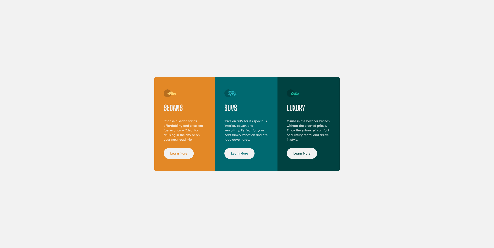

# Frontend Mentor - 3-column preview card component solution

This is a solution to the [3-column preview card component challenge on Frontend Mentor](https://www.frontendmentor.io/challenges/3column-preview-card-component-pH92eAR2-). Frontend Mentor challenges help you improve your coding skills by building realistic projects. 

## Table of contents

- [Overview](#overview)
  - [The challenge](#the-challenge)
  - [Screenshot](#screenshot)
  - [Links](#links)
- [My process](#my-process)
  - [Built with](#built-with)
  - [What I learned](#what-i-learned)
  - [Continued development](#continued-development)
- [Author](#author)

## Overview

### The challenge

Users should be able to:

- View the optimal layout depending on their device's screen size
- See hover states for interactive elements

### Screenshot



### Links

- Solution URL: [GitHub](https://github.com/Sengsith/3-column-card)
- Live Site URL: [Netlify](https://sengsith-3-column-card.netlify.app)

## My process

This is a mobile-first approach where I created the custom properties first, wrote the html, then finished up with all the general styling needed. I did have a few issues with writing the media query when needed to change grid layout from grid-template-rows to grid-template-columns where there would be extra space under the grid which seemd to come from the media query itself.

Originally, I wanted it to be:
```css
@media (min-width: 900px) {
  main {
    margin: 5rem 50rem;
    grid-template-columns: repeat(3, 1fr);
  }
}
```

But, there would be empty whitespace under my grid which comes from the main tag after the media query. I couldn't figure out how to deal with it so I changed it to a simple flexbox isntead.

```css
@media (min-width: 900px) {
  main {
    margin: 5rem 50rem;
    display: flex;
    justify-content: center;
  }
}
```

### Built with

- Semantic HTML5 markup
- CSS custom properties
- Flexbox
- CSS Grid
- Mobile-first workflow

### What I learned

I learned a little more about when to use grid vs flexbox. I did get cornered into an issue(explained above) with using grid which forced me to use flexbox. I think it looks fine but it was still an irritating issue that came up that I still don't know how or why it happened.

### Continued development

I would like to become better at debugging issues. Whether it was a good call or not to switch from grid to flexbox. I felt that I was pretty stubborn with wanting to keep the grid layout in the media query but decided to just change it to flexbox after not being able to figure out how to solve my issue.

## Author

- Frontend Mentor - [@Sengsith](https://www.frontendmentor.io/profile/Sengsith)